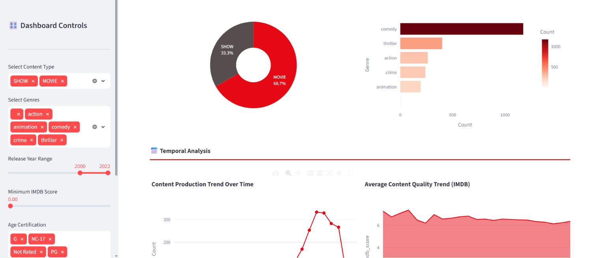
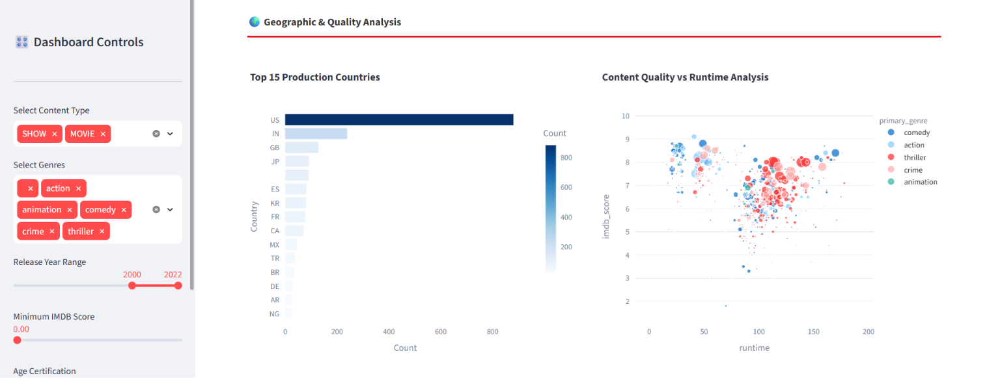

# 🎬 OTT Content Analytics Dashboard

> **A production-grade Data Science project** analyzing streaming content performance using Natural Language Processing, Machine Learning Clustering, and Interactive Business Intelligence Visualizations.

[](https://python.org)
[](https://streamlit.io)
[](https://scikit-learn.org)
[](https://plotly.com)

---

## 📋 Table of Contents

- [Project Overview](#project-overview)
- [Live Demo](#live-demo)
- [Tech Stack](#tech-stack)
- [Architecture](#architecture)
- [Machine Learning Components](#machine-learning-components)
- [Installation](#installation)
- [Usage](#usage)
- [Key Features](#key-features)
- [Screenshots](#screenshots)
- [Interview Talking Points](#interview-talking-points)
- [Future Enhancements](#future-enhancements)

---

## 🎯 Project Overview

This project is an **end-to-end Data Science solution** that transforms raw OTT (Over-The-Top) streaming data into actionable business intelligence. It demonstrates:

- **Data Engineering**: Cleaning, transforming, and structuring messy real-world data
- **Exploratory Data Analysis (EDA)**: Statistical analysis and pattern discovery
- **Natural Language Processing (NLP)**: TF-IDF vectorization for text-based recommendations
- **Unsupervised Machine Learning**: K-Means clustering for content segmentation
- **Data Visualization**: Interactive Plotly charts for stakeholder communication
- **Web Deployment**: Streamlit for rapid dashboard deployment

**Business Question Answered**: *What content should an OTT platform invest in, and how can we recommend the right content to the right audience?*

---

## 🌐 Live Demo

[Click here to view the live dashboard](https://ott-analytics-dashboard-1.streamlit.app/)

---

## 🛠️ Tech Stack

| Layer | Technology | Purpose |
|-------|-----------|---------|
| **Language** | Python 3.9+ | Core programming language |
| **Data Processing** | Pandas, NumPy | Data manipulation and numerical computing |
| **Machine Learning** | Scikit-Learn | TF-IDF, Cosine Similarity, K-Means Clustering |
| **Visualization** | Plotly | Interactive, publication-quality charts |
| **Dashboard** | Streamlit | Rapid web app development for data science |
| **Version Control** | Git, GitHub | Code management and portfolio showcase |

---

## 🏗️ Architecture

```
┌─────────────────┐
│   Raw Dataset   │  ← Netflix catalog data (CSV)
│  (Kaggle Source)│
└────────┬────────┘
         │
         ▼
┌─────────────────┐
│  Data Cleaning  │  ← Pandas (handle missing values, type conversion,
│   & Processing  │     feature engineering: primary_genre, primary_country)
└────────┬────────┘
         │
    ┌────┴────┐
    ▼         ▼
┌────────┐ ┌─────────────┐
│   EDA  │ │  ML Models  │
│& Viz   │ │  (Scikit)   │
│Plotly  │ │             │
└────────┘ │ • TF-IDF    │
           │ • Cosine Sim│
           │ • K-Means   │
           └──────┬──────┘
                  │
                  ▼
           ┌─────────────┐
           │  Streamlit  │
           │  Dashboard  │
           │  (Web App)  │
           └─────────────┘
```

---

## 🤖 Machine Learning Components

### 1. Content-Based Recommendation Engine

**Algorithm**: TF-IDF + Cosine Similarity

**What it does**: Recommends movies/shows similar to a user-selected title by analyzing the text content (title, description, genres).

**Why it matters**: This is the same technology Netflix uses for "Because you watched..." recommendations.

**Technical Details**:
- **TF-IDF (Term Frequency - Inverse Document Frequency)**: Converts text into numerical vectors where rare, meaningful words (like "zombie", "romance", "space") get higher weights than common words ("the", "and", "movie").
- **Cosine Similarity**: Measures the cosine of the angle between two TF-IDF vectors. A value of 1 means identical content; 0 means completely different.
- **Complexity**: O(n²) for pairwise similarity on n items. For 5,000 titles, this is manageable and cached via `@st.cache_data`.

### 2. K-Means Content Clustering

**Algorithm**: K-Means Clustering (unsupervised learning)

**What it does**: Automatically discovers 5 natural groupings of content based on:
- IMDB Score (quality indicator)
- Runtime (content length)
- Release Year (content freshness)
- TMDB Popularity (audience engagement)

**Why it matters**: Helps content strategists understand what "types" of content exist in their catalog and identify gaps.

**Technical Details**:
- **StandardScaler**: Normalizes features to mean=0, std=1 because IMDB (0-10) and Runtime (0-200) are on different scales.
- **K-Means++ Initialization**: Smart centroid placement for faster convergence.
- **Elbow Method**: K=5 was chosen as a balance between interpretability and granularity.

---

## ⚙️ Installation

### Prerequisites
- Python 3.9 or higher
- pip (Python package manager)

### Step 1: Clone the repository
```bash
git clone https://github.com/YOUR_USERNAME/ott-analytics-dashboard.git
cd ott-analytics-dashboard
```

### Step 2: Create a virtual environment (recommended)
```bash
# Windows
python -m venv venv
venv\Scripts\activate

# macOS/Linux
python3 -m venv venv
source venv/bin/activate
```

### Step 3: Install dependencies
```bash
pip install -r requirements.txt
```

### Step 4: Download the dataset
1. Go to [Kaggle - Netflix Movies and Shows](https://www.kaggle.com/datasets/maso0dahmed/netflix-movies-and-shows)
2. Download the CSV file
3. Rename it to `netflix_titles.csv` and place it in the project root folder

### Step 5: Run the dashboard
```bash
streamlit run app.py
```

The dashboard will automatically open in your browser at `http://localhost:8501`

---

## 🚀 Usage

### Interactive Filters (Left Sidebar)
- **Content Type**: Filter for Movies, TV Shows, or both
- **Genres**: Select specific genres of interest
- **Release Year**: Drag the slider to focus on a time period
- **IMDB Score**: Set minimum quality threshold
- **Age Certification**: Filter by content rating (PG, R, TV-MA, etc.)

### Dashboard Sections
1. **KPI Cards**: High-level metrics at a glance
2. **Content Distribution**: Pie chart (Movies vs Shows) and genre bar chart
3. **Temporal Analysis**: Trends over time for volume and quality
4. **Geographic Analysis**: Top production countries
5. **Quality vs Runtime**: Scatter plot revealing content patterns
6. **ML Clustering**: 3D visualization of algorithm-discovered content groups
7. **Recommendation Engine**: Type a title to get AI-powered suggestions
8. **Data Explorer**: Downloadable filtered dataset

---

## ✨ Key Features

- ✅ **Fully Interactive**: Every chart and metric updates in real-time as you change filters
- ✅ **Machine Learning Powered**: Real NLP and clustering algorithms, not just visualizations
- ✅ **Business-Ready**: Answers real OTT platform questions about content strategy
- ✅ **Mobile Responsive**: Works on desktop and mobile browsers
- ✅ **One-Click Deploy**: Ready for Streamlit Community Cloud (free hosting)
- ✅ **Performance Optimized**: `@st.cache_data` ensures ML models compute only once

---

## 📸 Screenshots

## 📸 Screenshots

### 1. Dashboard Overview


### 2. Content Distribution


### 3. Temporal Trends


### 4. Geographic Analysis


### 5. ML Clustering (3D)


### 6. Recommendation Engine


---

## 🔮 Future Enhancements

- [ ] **Collaborative Filtering**: Matrix factorization using user ratings (SVD, ALS)
- [ ] **Sentiment Analysis**: NLP on user reviews using transformers (BERT)
- [ ] **Predictive Modeling**: Forecast which content will trend based on features
- [ ] **Real-time Data Pipeline**: Apache Kafka + Airflow for live data ingestion
- [ ] **User Authentication**: Personalized dashboards per user
- [ ] **A/B Testing Framework**: Measure recommendation click-through rates

---

## 📄 License

This project is for educational and portfolio purposes. Dataset courtesy of [Kaggle](https://www.kaggle.com) 

---

## 🙋 About the Author

**[Rudraksh Gupta]** - Aspiring Data Scientist passionate about turning data into decisions.

---

> ⭐ If you found this project helpful, please star the repository! It helps others discover it.
